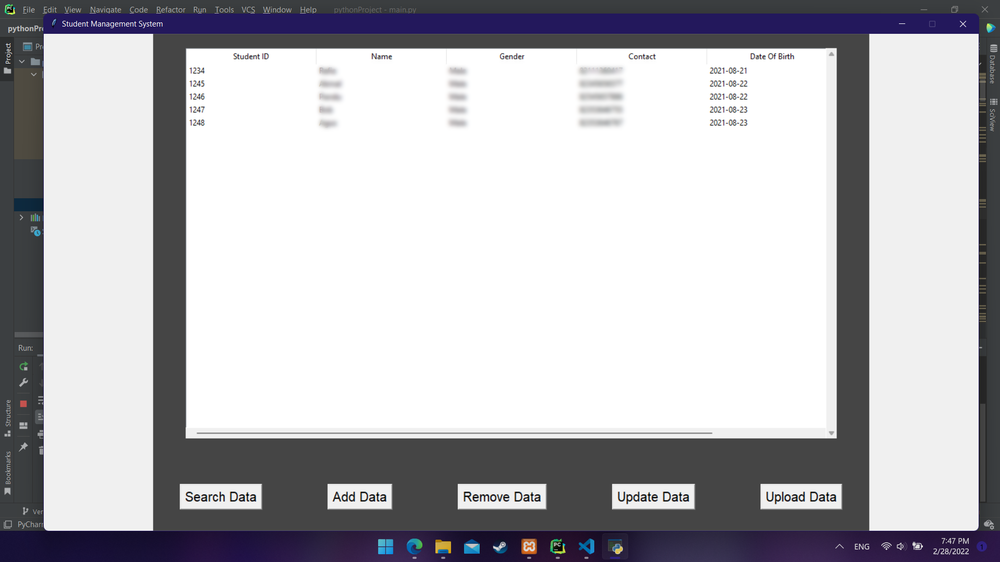

###  <center> Student Management System</center>
####  <center> Documentation: </center>

[](https://t.me/vinayak_09)

#### Fetures :
- MySQL database
- Basic Validation of input
- Add data
- Remove data
- Update data
- Upload data using CSV file
- Exception handling

#### Prerequisites :
- Python 3
- MYSQL/XAMPP
- Import student.sql file in phpmyadmin

#### MYSQL database and table :
```
Database: student 
Table: students
```


#### How to Run this Project?
- Clone this project or Download Zip.
- Extract it and Open the Project in any IDE (Visual Studio Code or Pycharm)
- Open terminal (cmd in case of WIndows) and run following command
```shell
$ pip3 install pymysql
$ pip3 install mysqlclient
$ pip3 install tk
$ pip3 install pandas
$ pip3 install sqlalchemy
$ pip3 install mysql-connector-python
$ python3 main.py
```
